neoPixel_Sequencer
==================

A digital music style sequencer built in Processing for designing patterns for neoPixel rings (WS2812 LEDs) and then Arduino code for playing them back in a loop.
Getting Started
------------------------
Please note, this is a sequencer for designing patterns that you load onto an arduino compatible device, not for direct real-time serial control of the LEDs. The Processing sketch creates a .txt file already formatted for using in the accompanying arduino file. The instructions assume you have the [Processing](http://processing.org) and [Arduino](http://arduino.cc) IDEs already installed and [Arduino is set for your particular board](http://arduino.cc/en/Guide/MacOSX#toc7).
Setup Processing
--------------------------
- [Download the project files](https://github.com/digitalcoleman/neoPixel_Sequencer/archive/master.zip) and move the neo_pixel_sequencer folder to your Processing sketches folder (Usually called Processing and in your Documents folder)
- Open Processing
- In the Processing select Menu Sketch -> Import Library -> Add Library
- Search for and install the "ControlP5" library
- Open the neo_pixel_sequencer.pde file and hit Play

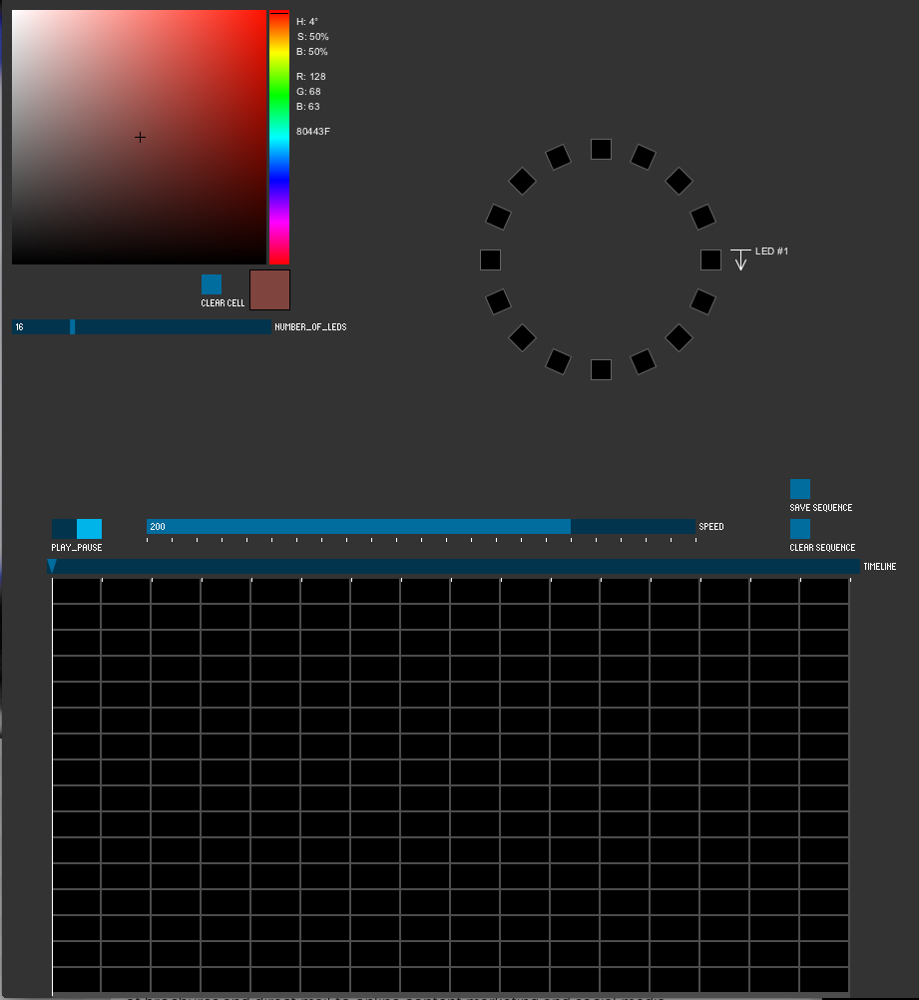

Using the Sequencer
---------------------------------
- First set the number of pixels in your ring using the slider just below the color picker

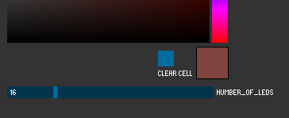
- The interface is divided into the top and bottom half. The top is for adding colors and the bottom is for controlling time and playback.
- To begin, first click on an LED that you would like to set the color for. it will then be highlighted and filled with the current color in the color picker. 

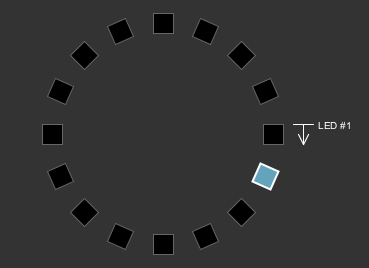

- If you want to set other LEDs to the same color, select them one by one.
- Each time you change the color in the color picker, it will also change the LED that is currently selected.

- You will notice the colors of the LEDs are also represented in the timeline in the bottom half of the program as the first column in the sequence.

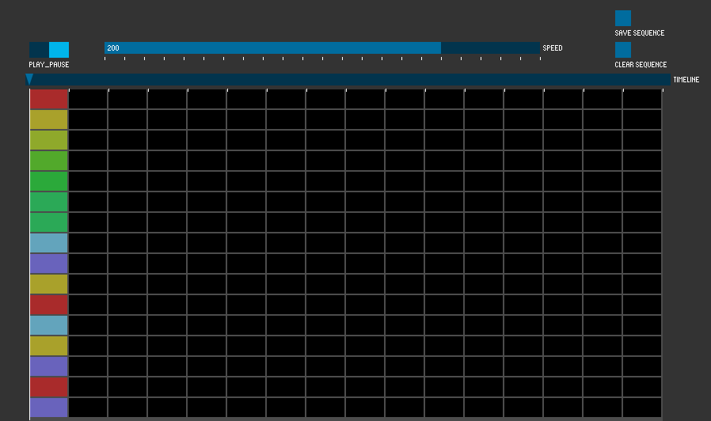

- Select the next slice of time by moving the playhead one column to the right. The playhead is a small blue triangle.

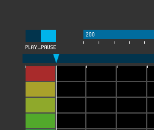

- Now select LEDs and set their colors for the new time slice. As a default the sequencer uses 16 slices (4/4 with 4 measures) but if you look at the code you will easily see how to change that number.
- Note that another method is to choose a color you would like to use thoughout the timeline and set each LED with the color in every time slice. For example here we have set a blue color which will move around the ring:

- We can then move back and forth in time, adding colors as needed.

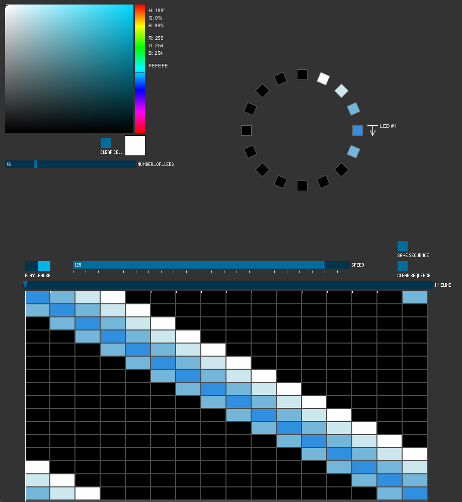

- When you are ready to see your LEDs in action, you can press the Play_Pause toggle button. The playhead will then move and loop through the sequence. You can adjust the speed using the Speed slider in realtime. It adjusts the number of milliseconds between each time slice, ranging from 75 to 625 milliseconds.

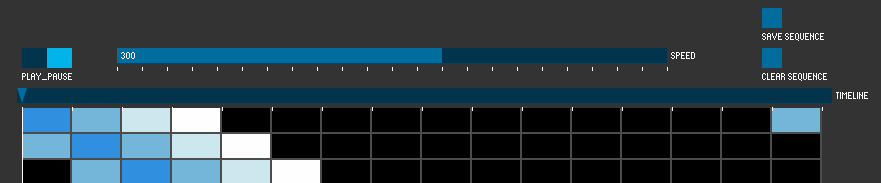

- Once you are satisfied with the sequence, hit the "Save Sequence" button and it will export a text file with your sequence called "ledSequence.txt" Please note that every time you hit this button it will write over your previous version so re-name the file if you want to keep it. To quickly find the file go back to the Processing IDE and click Sketch -> Show Sketch Folder

Setup Arduino
---------------------------------
- First move the neo_pixel_player folder to your Arduino sketches folder (Usually called Arduino and in your Documents folder)
- Download the driver and follow the instructions on this page to install the driver and then wire your neopixels to your Arduino board. [Adafruit Neo-Pixel Library](https://learn.adafruit.com/adafruit-neopixel-uberguide/arduino-library)
- Open the Arduino IDE
- In the Arduino IDE select File->Open and select "neo_pixel_player.ino" 

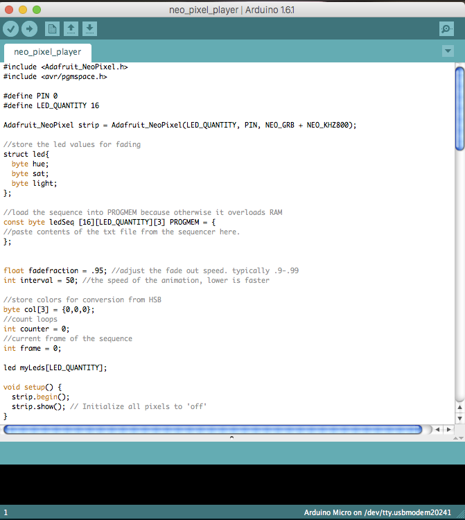

- The first change you will need to make is for the pin number you are using on your arduino as the data pin for the neo pixels. As a default it is set to pin 0 but if you follow the instructions on the Adafruit page you will need to change this to pin 6. Simply change the number after "#define PIN" to match your setup. 

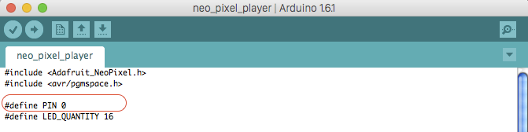
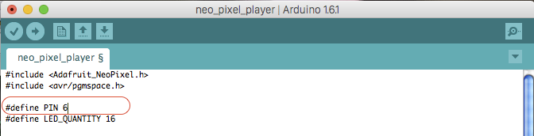

- Next you need to adjust the number of LEDs on your ring. The default is 16 but you will need to adjust for whatever ring you bought. Simply change the number after "#define LED_QUANTITY" to the number of LED's on your hardware.

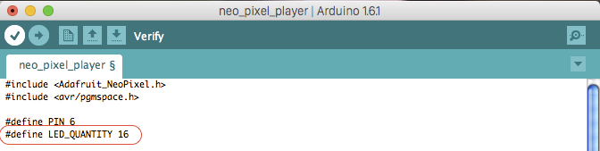

- The last edit you have to do is to add the text from your "ledSequence.txt" file to the arduino sketch where it is indicated. (See the screenshots below) You must open the "ledSequence.txt" file in a basic text editor like wordpad or textedit and select all of the text and copy it. Then go to the part of the code on line 18 where it says "//paste contents of the txt file from the sequencer here.", select that line, and paste the text from your txt file there in it's place.

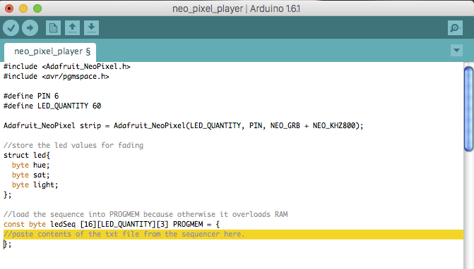
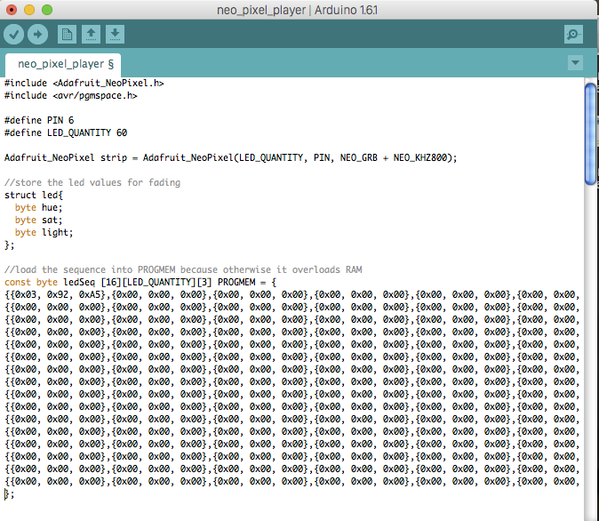

- At this point you can verify your code by hitting the checkmark in the upper left corner. Be sure that you have selected your board and your serial port under the "Tools" menu. Then you can Upload the code to your board and watch it go by pressing the Upload arrow to the right of the Verify checkmark.
- If you want to adjust the speed, there is a variable for the interval or number of "cycles" you want to wait before changing the LED to the next color called "interval" and it is set to 50 as a default. Lower values will speed up your patterns.

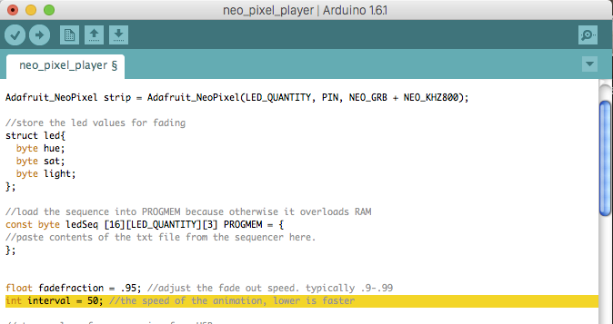

- You might also notice that the LEDs are fading out and do not turn off instantly. This is an aesthetic decision I like, but you can easily adjust it to fade slower or quicker by changing the number on the variable called "fadefraction." For a slow fade try changing it to .99 or for almost no fade try .50.

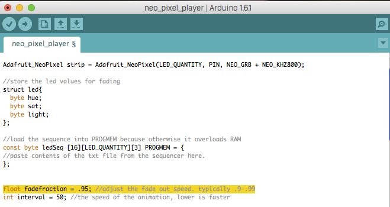

- Hopefully you have it up and running, but if you are having troubles, make sure you can run some of the NeoPixel example files before using the neo-pixel player.